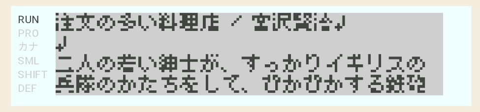
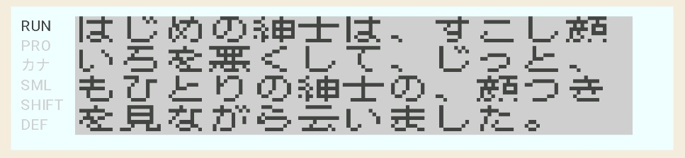
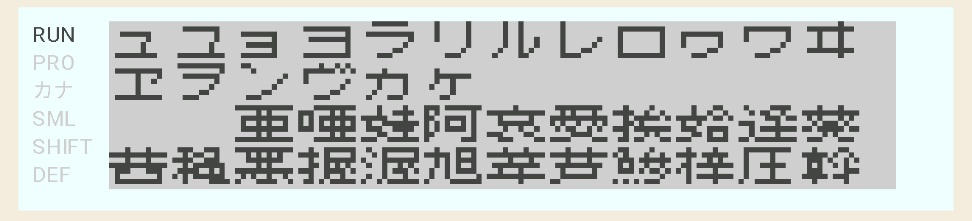
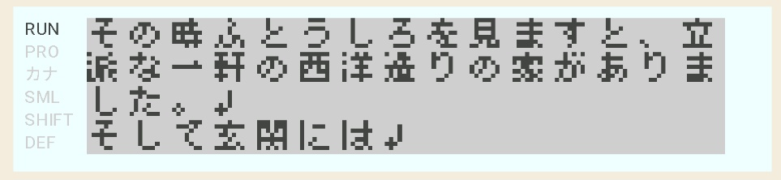
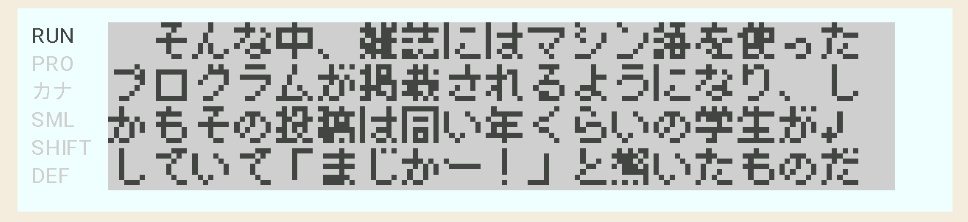

# kanji-system
## ポケコン用漢字表示システム Kanji character display system for Pocket Computer

シャープ製ポケットコンピュータ **PC-1350/60/60K用漢字表示システム**
by **けいくん＠ちた** ([@pockecom_love](https://x.com/pockecom_love))



## 対象機種 Target Machine

・PC-1350 （要16KB RAMカード）  
・PC-1360/K （要32KB RAMカード）

## 開発言語 Development Language

・SC61860アセンブラ（[SC61860 CROSS ASSEMBLER](https://hd61700.yukimizake.net/SC61860/index.html)）

## 主な機能 Main Functions

・表示モード：25桁4行（全角12桁4行、全角25桁4行）、30桁4行（全角15桁4行）、37桁4行（全角18桁4行）  
・漢字フォント：6x8ドット日本語フォント（実質5x7ドット）、8x8ドット日本語フォント（実質7x7ドット）、12x8日本語フォント（実質11x7ドット）  
・半角フォント：4x7ドット独自フォント、5x7ドットシステムフォント

## アセンブル方法 Assembly Method

```
SC61 kanji.s /b
```

## 設定 Setting

```assembly
TARGET		equ   1360	; PC-1350は 1350、PC-1360/60Kは 1360 を指定
KANJI		equ   7		; 漢字フォントの横ドット数(5 or 7 or 11)を指定
COLUMN		equ   37	; 桁数(25 or 30 or 37)を指定
				;  (11ドット漢字フォント使用時は37指定不可)
FONT		equ   1		; フォント読み込み…1
TEXT		equ   1		; テキストデータ読み込み…1

				; --- ツールの設定 ---
TOOL		equ   3		; 同梱ツールの選択
				;  (1…全角順次表示、2…テキスト表示
				;   3…テキストビューア、4…ベンチマークテスト)
NOSCROLLUP	equ   0		; [TOOL1]スクロールアップなし…1
KEYSTOP		equ   0		; [TOOL1,2]キーストップする…1
KEYSCAN		equ   1		; [TOOL1,2,3]キー入力ルーチン(1…有効)
CRMARK		equ   1		; [TOOL3]改行マーク(1…表示)

				; --- おまけ ---
STRING_FLAG	equ   0		; 文字列表示(API)(1…有効)
CURSOR_FLAG	equ   0		; カーソル設定(API)(1…有効)
PRINT_FLAG	equ   0		; 拡張PRINT文(1…有効) ※ PC-1350専用

		if TARGET = 1350
LOAD_ADR		equ   $2040	; オブジェクトロードアドレス
TOOL_ADR		equ   $6960	; ツール先頭アドレス
LINENUMBER_BUF		equ   $6D00	; [TOOL3]行番号ポインタバッファ
LINE_MAX		equ   127	; [TOOL3]最大行番号(4～255)
		else
LOAD_ADR		equ   $8040
TOOL_ADR		equ   $F600
LINENUMBER_BUF		equ   $FB00
LINE_MAX		equ   255
		endif
```

## 謝辞 Thanks

[Little Limit](https://littlelimit.net/font.htm) で公開されている極小日本語フォントを利用しました。素晴らしいフォントを開発、公開してくださりありがとうございます。  

[SC61860 Lab.](https://hd61700.yukimizake.net/) で公開されているクロスアセンブラ [SC61860 CROSS ASSEMBLER](https://hd61700.yukimizake.net/SC61860/index.html) を利用しました。高性能なアセンブラを開発、公開してくださりありがとうございます。  

[ポケコンfanのページ](https://digihori.jimdofree.com/) で公開されているポケコンエミュレータ [Pokecom GO](https://digihori.jimdofree.com/index/emulator/) を動作確認などに利用しました。素晴らしいソフトウェアを開発、公開してくださりありがとうございます。

## 実行例 Execution example

ポケコンエミュレータ [Pokecom Go](https://digihori.jimdofree.com/index/emulator/)での実行画面です。

25桁モード（注文の多い料理店より）
  

25桁モード（JISコード表）
  

30桁モード（注文の多い料理店より）
  

37桁モード（独習SC61860より）
  

同梱ツール 簡易テキストビューア  

https://github.com/user-attachments/assets/a2e176e7-c2c4-47c7-a821-b7a3e0fcdc25

## ライセンス License
 
The source code is licensed MIT. The website content is licensed CC BY 4.0,see LICENSE.
